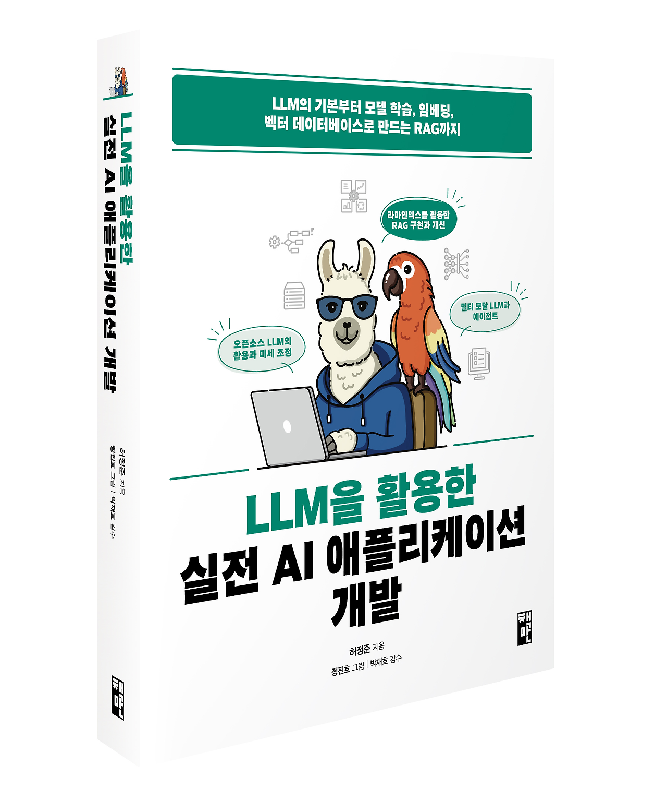

### LLM을 활용한 실전 AI 애플리케이션 개발

</img><br/>

### This code is a modified version from [here](https://github.com/onlybooks/llm).
- This code has been confirmed and tested to work correctly on both GPUs of A100 (80GB) and RTX 4090 (24GB).

### Setting Python Environments
- Dev Environments
  - OS: Ubuntu 20.04
  - CUDA: 12.1
  - CUDNN: 8.9.0
  - Python: 3.9 
```shell
$ git clone https://github.com/hyunkoome/Study_LLM.git
$ cd Study_LLM
$ conda create -n llmbook python==3.9
$ conda activate llmbook
$ pip install torch==2.3.1 torchvision==0.18.1 torchaudio==2.3.1 --index-url https://download.pytorch.org/whl/cu121
$ pip install transformers[torch]==4.44.1
$ cd AutoGPTQ
$ pip install -vvv --no-build-isolation -e .
$ cd ..
$ pip install -r 01_dev_AI_using_lmm/requirements.txt --use-deprecated=legacy-resolver
```

### 주요 책 목차 
- `[1부] LLM의 기초 뼈대 세우기`
  - 1장 LLM 지도
    - 임베딩: 딥러닝 모델이 데이터를 표현하는 방식
    - 언어 모델링: 딥러닝 모델의 언어 학습법
    - RNN, 트랜스포머 아키텍처, LLM, sLLM, LLM의 환각 현상을 대처하는 검색 증강 생성(RAG) 기술 등 요약 
  - 2장 LLM의 중추, 트랜스포머 아키텍처 살펴보기
  - 3장 트랜스포머 모델을 다루기 위한 허깅페이스 트랜스포머 라이브러리
  - 4장 말 잘 듣는 모델 만들기
    - LLM 사전 학습과 지도 미세 조정, 강화학습, PPO, RLHF, 기각 샘플링, DPO


- `[2부 LLM 길들이기]`
  - 5장 GPU 효율적인 학습
    - 양자화로 모델 용량 줄이기
    - 효율적인 학습 방법(PEFT): LoRA
    - 효율적인 학습 방법(PEFT): QLoRA
    - 4비트 양자화와 2차 양자화
    - 등 
  - 6장 sLLM 학습하기(실습: Text2SQL)
  - 7장 모델 가볍게 만들기
    - KV 캐시 메모리 줄이기
    - 양자화로 모델 용량 줄이기(비츠앤바이츠, GPTQ, AWQ, 지식 증류 등)
  - 8장 sLLM 서빙하기
    - 효율적인 배치 전략(일반 배치(정적 배치), 동적 배치, 연속 배치)
    - 효율적인 트랜스포머 연산(플래시어텐션, 플래시어텐션 2, 상대적 위치 인코딩)
    - 효율적인 추론 전략(커널 퓨전, 페이지어텐션, 추측 디코딩)
    - 실습: LLM 서빙 프레임워크(오프라인 서빙, 온라인 서빙)


- `[3부] LLM을 활용한 실전 애플리케이션 개발`
  - 9장 LLM 애플리케이션 개발하기
    - 검색 증강 생성(RAG) - 실습: 라마인덱스로 RAG 구현하기
    - LLM 캐시 - 실습: OpenAI API 캐시 구현
    - 데이터 검증 (실습 포함)
    - 데이터 로깅 - 실습: OpenAI API 로깅, 라마인덱스 로깅
  - 10장 임베딩 모델로 데이터 의미 압축하기
    - 텍스트 임베딩, 문장 임베딩 방식
    - 실습: 의미 검색 구현하기(라마인덱스에서 Sentence-Transformers 모델 사용)
      - 하이브리드 검색 구현하기(BM25 + 상호 순위 조합 + ...)
  - 11장 자신의 데이터에 맞춘 임베딩 모델 만들기: RAG 개선하기
    - 언어 모델을 임베딩 모델로 만들기
    - 임베딩 모델 미세 조정하기 
    - 검색 품질을 높이는 순위 재정렬
    - 바이 인코더와 교차 인코더로 개선된 RAG 구현하기
  - 12장 벡터 데이터베이스로 확장하기: RAG 구현하기
    - KNN 검색
    - ANN 검색
      - 탐색 가능한 작은 세계(NSW)
      - HNSW 인덱스
    - 파인콘을 활용해 멀티 모달 검색 구현하기
      - 파인콘, 라마인텍스, GPT-4o, DALL-E 3 활용
  - 13장 LLM 운영하기
    - MLOps, LLMOps
    - LLM 평가하기, RAG 평가


- `[4부] 멀티 모달, 에이전트 그리고 LLM의 미래`
  - 14장 멀티 모달 
    - 멀티 모달 LLM
    - 이미지와 텍스트를 연결하는 모델: CLIP
    - 텍스트로 이미지를 생성하는 모델: DALL-E
    - LLaVA
  - 15장 LLM 에이전트
    - 단일 에이전트, 사용자와 에이전트의 상호작용, 멀티 에이전트
    - 에이전트 구현 - 실습 (AutoGen 활용): RAG 에이전트, 멀티 모달 에이전트
  - 16장 새로운 아키텍처
    - 기존 아키텍처의 장단점
    - SSM
    - 선택 메커니즘
    - 맘바   
