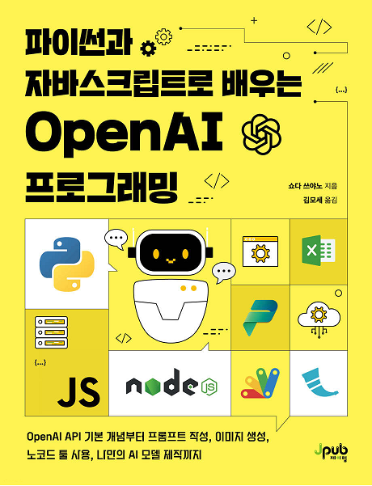

### 파이썬과 자바스크립트로 배우는 OpenAI 프로그래밍

</img><br/>

### This code is a modified version from [here](https://github.com/moseskim/openaiapi).
- This code has been confirmed and tested to work correctly on both GPUs of A100 (80GB) and RTX 4090 (24GB).

### Setting Python Environments
- Dev Environments
  - OS: Ubuntu 20.04
  - CUDA: 12.1
  - CUDNN: 8.9.0
  - Python: 3.9 
```shell
$ git clone https://github.com/hyunkoome/Study_LLM.git
$ cd Study_LLM
$ conda create -n llmbook python==3.9
$ conda activate llmbook
$ pip install torch==2.3.1 torchvision==0.18.1 torchaudio==2.3.1 --index-url https://download.pytorch.org/whl/cu121
$ pip install transformers[torch]==4.44.1
$ cd AutoGPTQ
$ pip install -vvv --no-build-isolation -e .
$ cd ..
$ pip install -r src/requirements.txt --use-deprecated=legacy-resolver
```

------------------------------------------------------

이 실습 코드는 다음 환경에서 동작을 확인했습니다. 환경이 다른 경우 전혀 동작하지 않거나 오동작할 수 있습니다. 책의 설명과 동작이 다를 때는 환경을 꼭 확인해 주십시오.

- 운영체제: Windows 10 22H2
- Python 및 openai 라이브러리
  - Python 3.11
  - `openai` 0.28.1
- Node.js 및 openai 라이브러리
  - Node.js 20.14 LTS
  - `openai` 3.3.0

------------------------------------------------
### 주요 책 목차 
- 